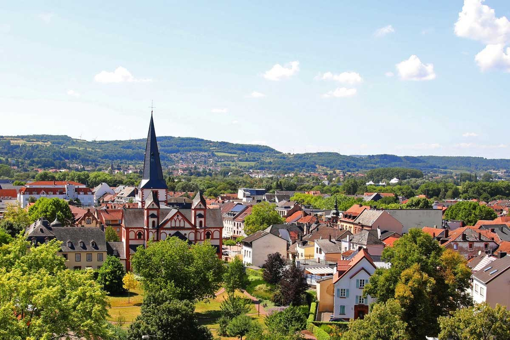

# Willkommen zur digitalen Stadtführung durch Merzig!

___

## **Einführung:**

Merzig, eine Stadt mit Herz und Geschichte, lädt Sie zu einer unvergesslichen Entdeckungsreise ein. Mit 17 Stadtteilen und einer faszinierenden Mischung aus Natur, Kultur und Geschichte bietet Merzig eine reiche Palette an Erlebnissen. Von der romanischen Pfarrkirche St. Peter bis hin zum einzigartigen feinmechanischen Museum in der Fellenbergmühle – jede Ecke von Merzig erzählt eine eigene Geschichte.

## **Tour-Highlights:**

- **Saline im Merziger Stadtpark:** Ein Ort des Wohlbefindens und der Gesundheit.
- **Halfenhaus:** Ein Zeugnis der Binnenschifffahrtstradition.
- **Historisches Stadthaus:** Ein architektonisches Juwel.
- **St. Peter:** Der älteste romanische Sakralbau des Saarlandes.
- **Feinmechanisches Museum:** Einblicke in die industrielle Vergangenheit.

## **Hinweise und Tipps:**

- **Tour-Dauer:** Etwa 3 bis 4 Stunden, je nach Verweildauer an den einzelnen Stationen.
- **Bequemes Schuhwerk:** Empfohlen, da die Tour sowohl Stadterkundungen als auch mögliche Spaziergänge in Parkanlagen umfasst.
- **Erholung und Gastronomie:** Nutzen Sie die vielfältigen Gastronomieangebote in der Stadt, um sich zu stärken und die lokale Küche zu genießen.
- **Kultur und Natur:** Merzig ist eine Stadt, die Kunst und Natur harmonisch verbindet – genießen Sie diese einzigartige Atmosphäre.

## **Ein paar Worte über Merzig:**

Mit rund 30.000 Einwohnern und einem Grünflächenanteil von 80 Prozent ist Merzig nicht nur eine „grüne Stadt“, sondern auch ein Zentrum der Baumschulkultur. Die Stadt ist stolz auf ihre historischen Wurzeln, die sich in beeindruckenden Bauwerken und einer reichen Tradition widerspiegeln. Ein besonderes Highlight ist der Wolfspark Werner Freund, der Wölfe aus aller Welt beherbergt.

Wir wünschen Ihnen eine informative und angenehme Tour durch Merzig – eine Stadt, die Geschichte, Kultur und Natur in sich vereint!

@[Los gehts!](kartenansicht.md)
